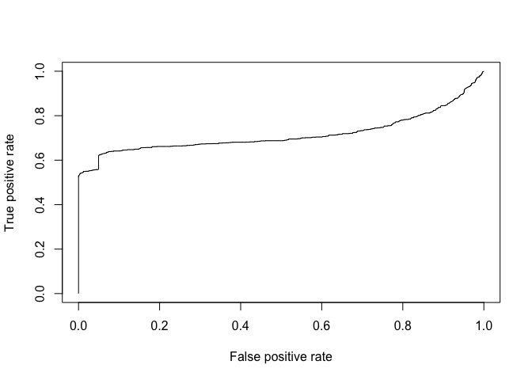

Project 4 Dilip Ganesan
================
Dilip Ganesan

Introduction
------------

It can be useful to be able to classify new "test" documents using already classified "training" documents. A common example is using a corpus of labeled spam and ham (non-spam) e-mails to predict whether or not a new document is spam.

For this project, you can start with a spam/ham dataset, then predict the class of new documents (either withheld from the training dataset or from another source such as your own spam folder). One example corpus: <https://spamassassin.apache.org/publiccorpus/>

Approach.
---------

1.  First we are going to load the files in Spam and Ham folder.

2.  We are going to extract the text from Spam and Ham documents.

3.  The text from these documents are converted to Term Document Matrix for training data creation.

4.  We are going build a classifier using the training data.

5.  We are going to test the classifier with the docs under test folders using SVM Model.

Loading of Files and cleaning the data.
---------------------------------------

``` r
#Directories for Training Data
spam.dir="~/Dilip_Docs/CUNY/DATA607-Data Accquisition and Management/Project_4/spam/"
ham.dir="~/Dilip_Docs/CUNY/DATA607-Data Accquisition and Management/Project_4/easy_ham/"

# Directories for Test Data.
spam.test.dir="~/Dilip_Docs/CUNY/DATA607-Data Accquisition and Management/Project_4/spam_2/"
ham.test.dir="~/Dilip_Docs/CUNY/DATA607-Data Accquisition and Management/Project_4/easy_ham_2/"

# Getting list of files from all the folders.
spam.docs=list.files(spam.dir)
ham.docs=list.files(ham.dir)
spam.test.docs=list.files(spam.test.dir)
ham.test.docs=list.files(ham.test.dir)

#Removing the .cmds files in all the folders.
spam.docs = spam.docs[which(spam.docs!="cmds")]
ham.docs=ham.docs[which(ham.docs!="cmds")]
spam.test.docs = spam.test.docs[which(spam.test.docs!="cmds")]
ham.test.docs=ham.test.docs[which(ham.test.docs!="cmds")]
```

Function to Extract Text Message
--------------------------------

``` r
# This function is used to just extract the text message in all the emails. Reference Machine Learning for Hackers. 
extractText=function(path){
con = file(path, open="rt", encoding="latin1")
text = readLines(con)
msg = text[seq(which(text=="")[1]+1,length(text),1)]
close(con)
return(paste(msg, collapse="\n"))
}
```

Extraction of Text Messages and Creation of Data Frame.
-------------------------------------------------------

``` r
all.spam = sapply(spam.docs, function(p) extractText(paste(spam.dir,p,sep="")))
all.ham = sapply(ham.docs, function(p) extractText(paste(ham.dir,p,sep="")))
#head(all.spam)
all.test.spam = sapply(spam.test.docs, function(p) extractText(paste(spam.test.dir,p,sep="")))
all.test.ham = sapply(ham.test.docs, function(p) extractText(paste(ham.test.dir,p,sep="")))

spam.dfr=as.data.frame(all.spam)
ham.dfr=as.data.frame(all.ham)
spam.test.dfr=as.data.frame(all.test.spam)
ham.test.dfr=as.data.frame(all.test.ham)

#Setting the outcomes as 1 for SPAM and 0 for HAM.
spam.dfr$Outcome=1
ham.dfr$Outcome=0
spam.test.dfr$Outcome=1
ham.test.dfr$Outcome=0
names(spam.dfr)=c("Text","Outcome")
names(ham.dfr)=c("Text","Outcome")
names(spam.test.dfr)=c("Text","Outcome")
names(ham.test.dfr)=c("Text","Outcome")
```

Training Data
-------------

``` r
trainingset=rbind(spam.dfr,ham.dfr)
trainingsize=nrow(trainingset)
```

Test Data Frames
----------------

``` r
testdataset=rbind(spam.test.dfr,ham.test.dfr)
testdatasize=nrow(testdataset)
```

Term Document Matrix
--------------------

``` r
fulldataset=rbind(trainingset,testdataset)
fulldataset.Outcome=fulldataset$Outcome
fulldataset.text=fulldataset$Text

# Creating the Matrix
matrix=create_matrix(fulldataset.text, 
                     language="english", 
                     minWordLength=3, 
                     removeNumbers=TRUE, 
                     stemWords=FALSE, 
                     removePunctuation=TRUE, 
                     weighting=weightTfIdf)

# Creating the container.
container=create_container(matrix,
                            t(fulldataset.Outcome), 
                            trainSize=1:trainingsize, 
                            testSize=(trainingsize+1):nrow(fulldataset), 
                            virgin=FALSE)
```

Model - Support Vector Machines. Since it is binary classification.
-------------------------------------------------------------------

``` r
svmmodel=train_model(container, "SVM")
svmresult=classify_model(container,svmmodel)
svmanalytics=create_analytics(container,svmresult)
#summary(svmanalytics)
svmdocsum= svmanalytics@document_summary


svm_spam.doc  = svmdocsum[svmdocsum$MANUAL_CODE==1, ]
svm_ham.doc   = svmdocsum[svmdocsum$MANUAL_CODE==0, ]
svm.true.pos  = round(nrow(svm_spam.doc[svm_spam.doc$CONSENSUS_CODE==1,]) / nrow(svm_spam.doc)*100,2)
svm.false.neg = round(nrow(svm_spam.doc[svm_spam.doc$CONSENSUS_CODE==0,]) / nrow(svm_spam.doc)*100,2)
svm.true.neg  = round(nrow(svm_ham.doc[svm_ham.doc$CONSENSUS_CODE==0,]) / nrow(svm_ham.doc)*100,2)
svm.false.pos = round(nrow(svm_ham.doc[svm_ham.doc$CONSENSUS_CODE==1,]) / nrow(svm_ham.doc)*100,2)

# Moved from using data frames to tibbles.
svmconfusionmatrix = tibble(Email=list("spam", "ham"), true=list(svm.true.pos,svm.true.neg), false=list(svm.false.neg,svm.false.pos))
knitr::kable(svmconfusionmatrix)
```

| Email | true  | false |
|:------|:------|:------|
| spam  | 92.98 | 7.02  |
| ham   | 98.64 | 1.36  |

ROC Curve using ROCR
====================

``` r
pred=prediction(svmdocsum$SVM_PROB,svmdocsum$PROBABILITY_CODE)
#class(pred)
#slotNames(pred)

roc.perf = performance(pred, measure = "tpr", x.measure = "fpr")
plot(roc.perf)
```



Conclusion.
-----------

From the model we can see the classifier is able to predict 98% of emails as Ham and 93% emails as SPAM.

References.
===========

<https://www.r-bloggers.com/a-small-introduction-to-the-rocr-package/> Machine Learning for Hackers.
